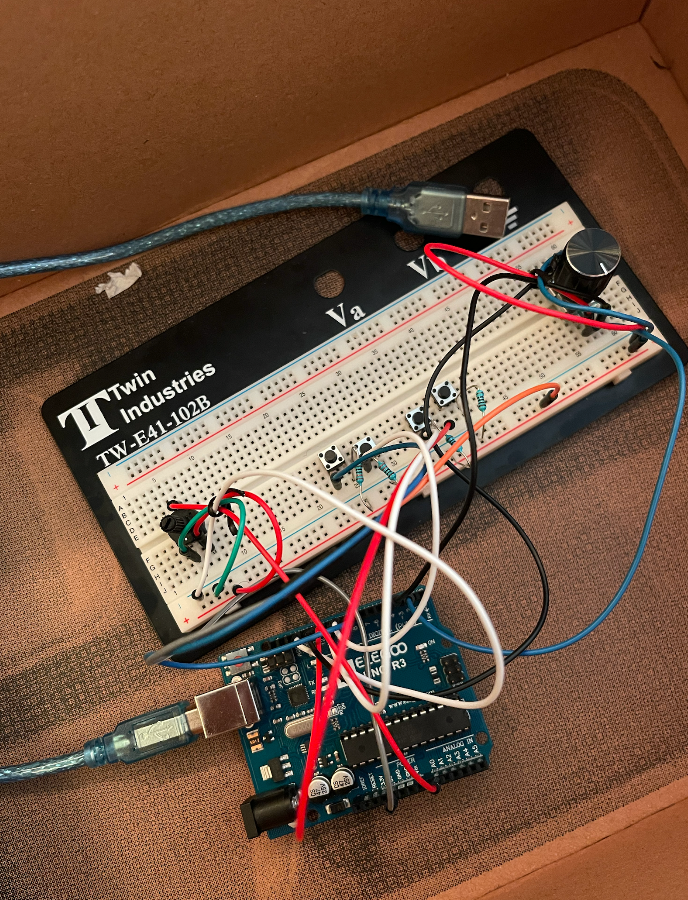
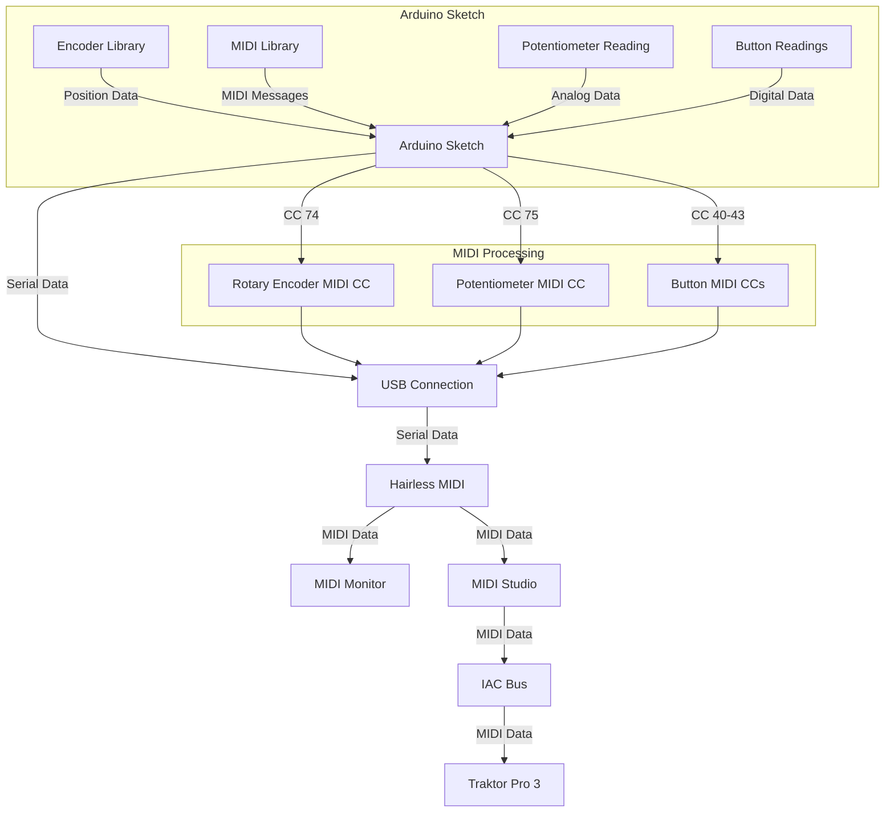
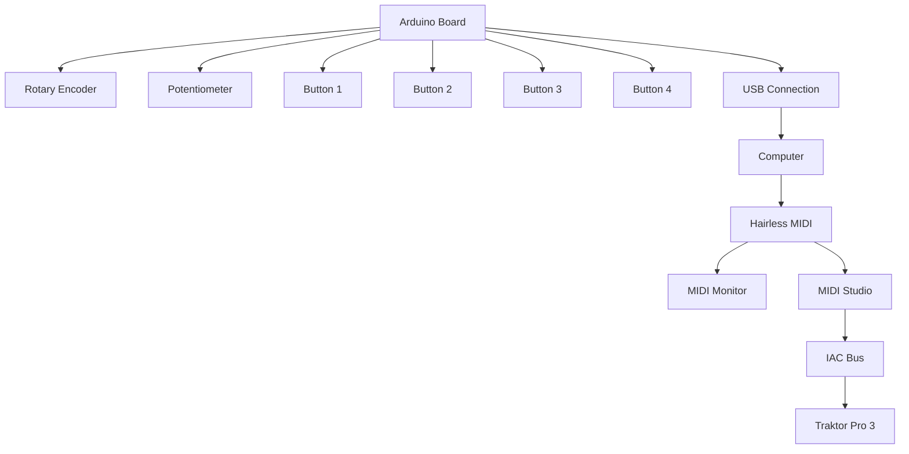

# Arduino DJ Controller

### Arduino & Breadboard wiring with buttons and rotary knob

## Overview
This project implements a DJ controller using Arduino for the Comp 522 course. The controller interfaces with DJ software, allowing for hands-on control of various parameters through MIDI communication.

## Features
- Custom DJ controller using Arduino
- Integration with Traktor Pro 3 DJ software
- MIDI communication for seamless software interaction
- Rotary encoder for precise control
- Potentiometer for continuous parameter adjustment
- 4 buttons for triggering actions or toggling states

## Hardware Components
- Arduino board
- Rotary encoder
- Potentiometer
- 4 buttons
- Wires
- Resistors

## Software Used
- Arduino IDE: For programming the Arduino board
- Encoder Library: For reading rotary encoder data
- MIDI Library: For MIDI communication
- Traktor Pro 3: DJ software
- Hairless MIDI: For MIDI communication between Arduino and computer
- MIDI Monitor: To verify MIDI signals
- MIDI Studio: Stock Mac app to activate IAC bus for inter-app MIDI transfer

## System Architecture
The project consists of two main parts:
1. Hardware setup (Arduino with components)
2. Software integration (Arduino sketch + MIDI processing + DJ software)

### Software Diagram

### Hardware Block Diagram

## Setup and Installation
1. Connect the hardware components according to the block diagram:
   - Connect the rotary encoder to pins 2 and 3
   - Connect the potentiometer to analog pin A0
   - Connect the buttons to pins 8, 9, 10, and 11
2. Install the required libraries in the Arduino IDE:
   - Encoder Library
   - MIDI Library
3. Upload the Arduino sketch to your board
4. Set up Hairless MIDI for MIDI communication
5. Configure MIDI Studio to enable IAC bus
6. Launch Traktor Pro 3 and configure MIDI mappings:
   - CC 74 on channel 1 for the rotary encoder
   - CC 75 on channel 2 for the potentiometer
   - CC 40-43 on channel 1 for the buttons

## Usage
1. The rotary encoder sends MIDI CC 74 on channel 1, which can be mapped to a continuous parameter in Traktor Pro 3 (e.g., filter cutoff)
2. The potentiometer sends MIDI CC 75 on channel 2, which can be mapped to another continuous parameter
3. The four buttons send MIDI CC 40-43 on channel 1 when pressed (value 127) and released (value 0), which can be mapped to trigger actions or toggle states in Traktor Pro 3
4. Adjust the `debounceDelay` variable in the code if you experience button bouncing issues

## Known Issues
- Initial design had too many connections on the breadboard, causing MIDI communication interference. The current version is a simplified design to address this issue.

## Future Improvements
- Add LED feedback for button states
- Implement shift functionality to increase the number of controllable parameters
- Create a custom enclosure for the controller

## Contributors
- Jimwell Castillo

